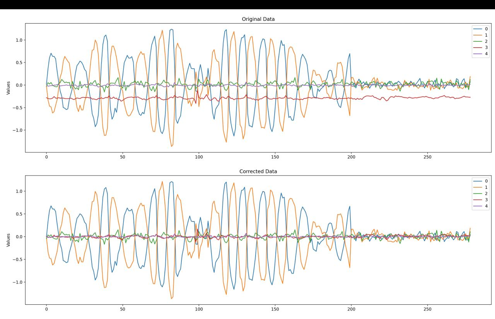

Вот ваши таблицы, представленные в формате Markdown (MD):

### Таблица: Static, In Run, R to R

|    | Static                | In Run                | R to R               |
|----|-----------------------|-----------------------|----------------------|
| 0  | 0.02560091683963034923 | 0.01382102000000000157 | 0.02560091683963034923 |
| 1  | 0.00259173916104269960 | -0.00403617032258064487 | 0.00259173916104269960 |
| 2  | 0.01331506060975260440 | 0.00994603161290322571 | 0.01331506060975260440 |
| 3  | -0.28350310321231680932 | -0.28077746580645157604 | -0.28350310321231680932 |
| 4  | -0.00098320405977860817 | 0.00428673483870967761 | -0.00098320405977860817 |
| 5  | 0.04473704671813726746 | 0.04832798064516050790 | 0.04473704671813726746 |

### Таблица: Static Corrected, In Run Corrected, R to R Corrected

|    | Static Corrected      | In Run Corrected       | R to R Corrected      |
|----|-----------------------|------------------------|-----------------------|
| 0  | 0.00000000000000000189 | -0.00237086714144411426 | 0.00000000000000000189 |
| 1  | 0.00000000000000000369 | -0.00521253847292683405 | 0.00000000000000000369 |
| 2  | 0.00000000000000000099 | -0.00604579420312051363 | 0.00000000000000000099 |
| 3  | -0.00000000000000001683 | 0.00044368671580360166 | -0.00000000000000001683 |
| 4  | 0.00000000000000000009 | -0.00015291313359497131 | 0.00000000000000000009 |
| 5  | -0.00000000000000041102 | 0.00556671239590253875 | -0.00000000000000041102 |

### Таблица: Static div, In Run div, R to R div

|    | Static div            | In Run div             | R to R div            |
|----|-----------------------|------------------------|-----------------------|
| 0  | 0.00000000000000007384 | -0.17154067799946126627 | 0.00000000000000007384 |
| 1  | 0.00000000000000142239 | 1.29145651851333265192 | 0.00000000000000142239 |
| 2  | 0.00000000000000007404 | -0.60785994237914542371 | 0.00000000000000007404 |
| 3  | 0.00000000000000005935 | -0.00158020770836876331 | 0.00000000000000005935 |
| 4  | -0.00000000000000009419 | -0.03567123681505775246 | -0.00000000000000009419 |
| 5  | -0.00000000000000918735 | 0.11518611623306013181 | -0.00000000000000918735 |

### Таблица: Во сколько раз стало лучше

|    | Static div | In Run div | R to R div |
|----|------------|------------|------------|
| 0  | 13541990254735886 | 6 | 13541990254735886 |
| 1  | 703041302439979 | 1 | 703041302439979 |
| 2  | 13505486112195160 | 2 | 13505486112195160 |
| 3  | 16849269588530820 | 633 | 16849269588530820 |
| 4  | 10616297410362284 | 28 | 10616297410362284 |
| 5  | 108845287936346 | 9 | 108845287